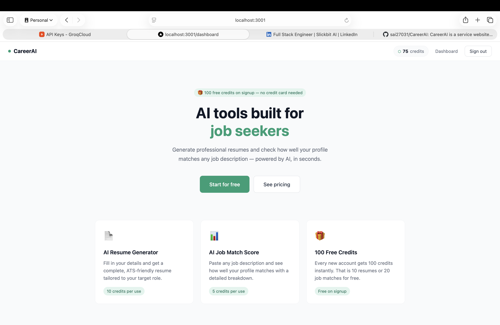
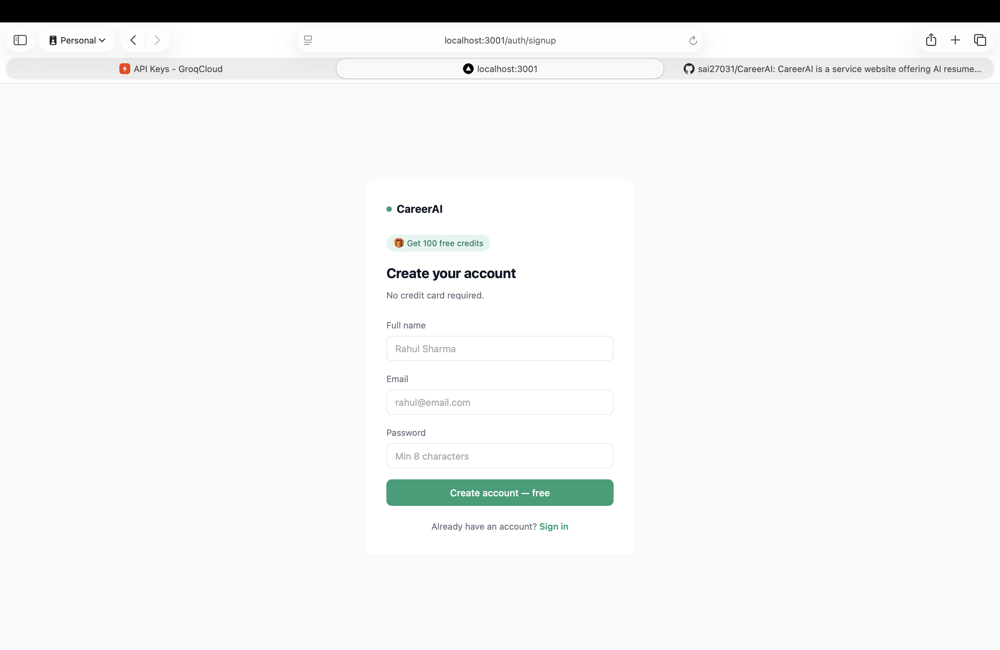
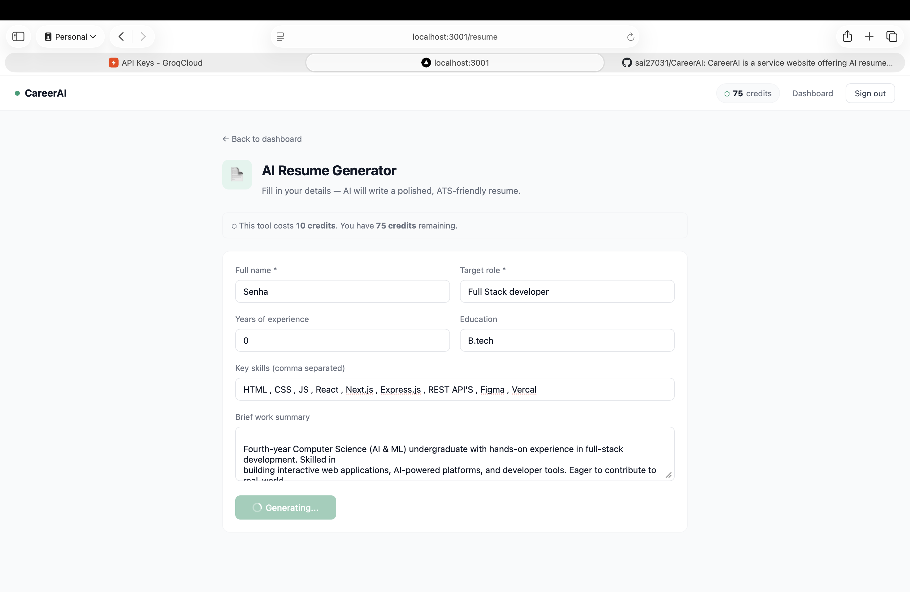
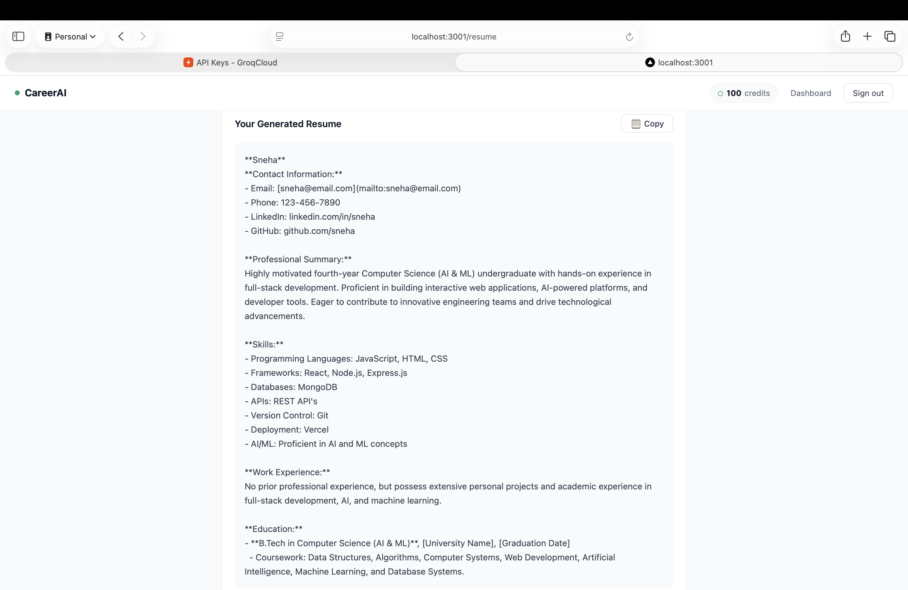
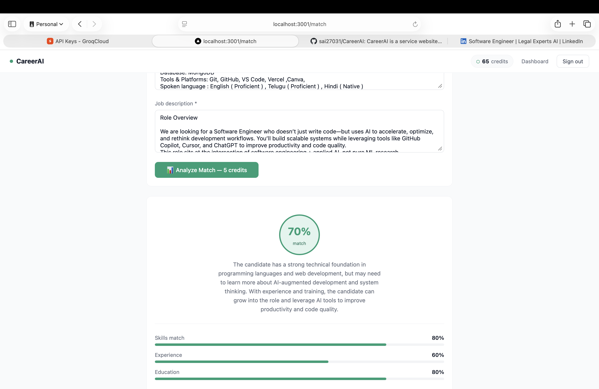
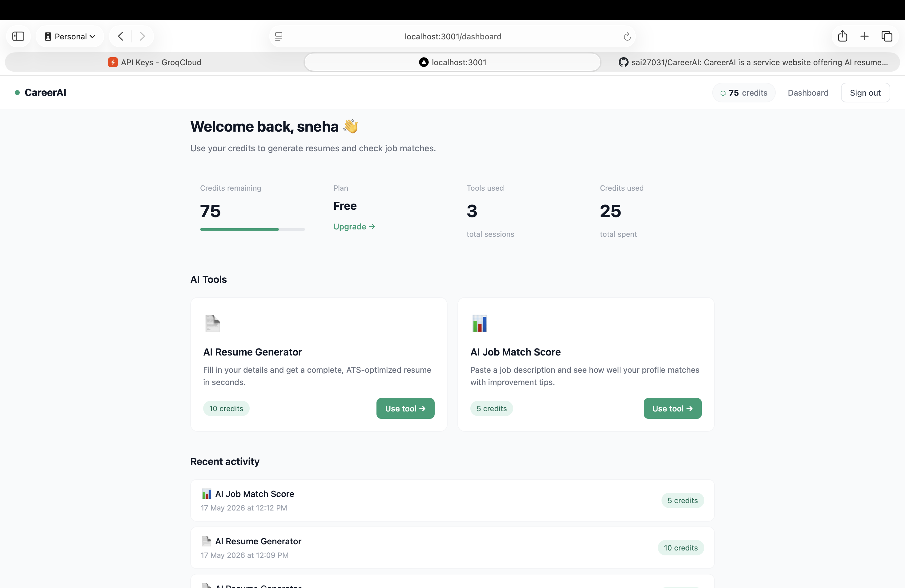

# CareerAI 🚀

An AI-powered SaaS platform built for job seekers.
Users get 100 free credits on signup and can use
AI tools to boost their job search.

## Screenshots

### Landing Page

### Sign Up

### AI Resume Generator

### AI Resume Output

### Job Match Score

### Dashboard

## Project Structure

    careerai/
    ├── src/
    │   ├── components/
    │   │   └── Navbar.js
    │   ├── lib/
    │   │   ├── supabase.js
    │   │   └── supabaseAdmin.js
    │   ├── pages/
    │   │   ├── api/
    │   │   │   ├── generate-resume.js
    │   │   │   ├── job-match.js
    │   │   │   ├── create-order.js
    │   │   │   ├── verify-payment.js
    │   │   │   └── credits.js
    │   │   ├── auth/
    │   │   │   ├── login.js
    │   │   │   └── signup.js
    │   │   ├── _app.js
    │   │   ├── index.js
    │   │   ├── dashboard.js
    │   │   ├── resume.js
    │   │   ├── match.js
    │   │   └── pricing.js
    │   └── styles/
    │       └── globals.css
    ├── screenshots/
    ├── next.config.js
    └── package.json

## Features

- 🔐 User authentication with Supabase
- 💳 Credit system — 100 free credits on signup
- 📄 AI Resume Generator — generates ATS-friendly resumes
- 📊 AI Job Match Score — matches your profile to any job description
- 💰 Subscription plans — ₹199/month or ₹899/year via Razorpay
- 📊 Usage history and credit tracking dashboard

## Tech Stack

- **Frontend** — React, Next.js, JavaScript, CSS
- **Backend** — Next.js API Routes, Node.js
- **Database & Auth** — Supabase (PostgreSQL)
- **AI** — Groq API (LLaMA 3.3 70B model)
- **Payments** — Razorpay

## Getting Started

1. Clone the repository

git clone https://github.com/sai27031/CareerAI.git

npm install

3. Create .env.local and add your keys
4. Run SQL schema in Supabase SQL editor
5. Start development server

npm run dev

## Author

Built by Talanki Sai Sujan